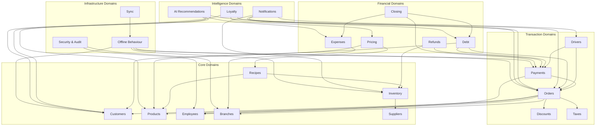

# Sonex Coffee OS — Domain Policy Catalog

**Version:** 2.0
**Document Type:** Official Business Rule Book
**Audience:** Business Stakeholders, Developers, Operations
**Status:** Draft

---

## Preface

This document is the official business specification for Sonex Coffee OS.

It describes WHAT the system must do, not HOW it is implemented.

Every policy herein is derived from existing code, business requirements, and operational best practices for multi-cafe coffee shop management in Egypt.

## How to Read This Document

Each policy follows this structure:

- **Policy ID** — Unique identifier for cross-referencing
- **Policy Name** — Human-readable name
- **Purpose** — Why this policy exists
- **Business Description** — Plain-language explanation
- **Preconditions** — What must be true before this policy applies
- **Trigger** — What event initiates this policy
- **Business Rules** — The core rules (numbered for traceability)
- **Validation Rules** — What must be checked before execution
- **Failure Conditions** — What constitutes failure and how it is handled
- **Expected Result** — What the system produces on success
- **Side Effects** — Other system changes that occur
- **Events Produced** — Notifications, WebSocket events, domain events
- **Security Constraints** — Who can do what
- **Offline Behaviour** — How this policy behaves when disconnected
- **Sync Behaviour** — How this policy's data synchronizes
- **Examples** — Concrete scenarios
- **Exceptions** — Edge cases and special handling
- **Related Policies** — Cross-references to other policies
- **Future Extension Notes** — Known gaps or planned enhancements

---

## Domain 1: Orders

### Policy ORD-001: Order Creation

**Purpose:** Record a customer's intent to purchase menu items.

**Business Description:** When a customer places an order (in-cafe, delivery, or via WhatsApp), the system creates an order record capturing the items, customer details, pricing, and metadata. Each order is assigned a unique code, an initial status of NEW, and a source type indicating where the order originated.

**Preconditions:**
- Cafe must be active
- At least one item must be in the order
- Customer must be identifiable (by ID or phone number)

**Trigger:** Customer check-out at POS, driver dispatch, or WhatsApp order intake.

**Business Rules:**
1. Every order must have a cafe context (multi-tenant).
2. Orders are assigned status NEW on creation.
3. Each order gets a human-readable code: `CAF-YYYYMMDD-<random>`.
4. Items with zero price are allowed (complementary items).
5. Total is calculated as sum of `item.price × item.quantity` for all items.
6. Source type must be one of: INSIDE_CAFE, OUTSIDE_CAFE, WHATSAPP_ORDER.
7. If a customer phone is provided but no customer record exists, a new customer is auto-created.
8. Idempotency key prevents duplicate order creation.

**Validation Rules:**
- Order items array must not be empty.
- Customer phone must be a valid Egyptian mobile number if provided.
- Product must exist and be active.
- Product must belong to the same cafe.
- Branch must exist and be active.

**Failure Conditions:**
- Missing or invalid items → Bad Request.
- Unknown customer identifier → Bad Request.
- Inactive cafe → 403 Forbidden.
- Duplicate idempotency key → silently return existing order.

**Expected Result:** An Order resource with status NEW, a unique code, calculated total, and all provided metadata.

**Side Effects:**
- Customer record is updated (totalSpent incremented, lastOrderDate set).
- Inventory is reserved for the order items (stock pending).
- Employee attribution is recorded if an employee "brought" the order.

**Events Produced:**
- `order.created` (WebSocket)
- `order.new` (domain event)

**Security Constraints:**
- Only authenticated BARISTA, DRIVER, or Cafe roles can create orders.
- Cafe context must match authenticated user's cafe.

**Offline Behaviour:** Orders are created locally with a pending sync flag. A temporary local ID is assigned. When online, the order is pushed to the server and the permanent ID replaces the local one.

**Sync Behaviour:** New orders are uploaded via the sync queue. Conflicts are resolved by last-write-wins on the server. Local orders that fail to sync are retried with exponential backoff.

**Examples:**
- Customer walks in, orders 2 cappuccinos → Order created with INSIDE_CAFE source, total = 2 × 25 EGP = 50 EGP.
- WhatsApp order for 1 latte, delivery → Order created with WHATSAPP_ORDER source.

**Exceptions:**
- Customer without phone cannot be identified → fallback to anonymous customer.
- Product with deleted recipe can still be ordered (uses manual price).

**Related Policies:** ORD-002 (Status Machine), INV-003 (Inventory Reservation), CUS-001 (Customer Auto-Create)

---

### Policy ORD-002: Order Status Machine

**Purpose:** Govern the lifecycle of a delivery order through predefined states with role-based transitions.

**Business Description:** Every order progresses through a linear state machine. Each transition requires a specific role. Invalid transitions and unauthorized roles are rejected. The machine enforces that orders flow in one direction from creation to closure, with cancellation available as an escape hatch.

**Preconditions:** Order exists and is in a non-terminal state.

**Trigger:** Authorized user requests a status change.

**Business Rules:**
1. Valid states: NEW, CONFIRMED, PREPARING, READY, PICKED_UP, DELIVERED, PAID, CLOSED, CANCELLED.
2. Initial status is always NEW.
3. CLOSED and CANCELLED are terminal states — no further transitions allowed.
4. Same-status transitions are idempotent (no error, no side effect).
5. Role authorization is enforced per transition (see transition table).
6. Timestamps are recorded at each transition step.
7. Optimistic concurrency control prevents race conditions.

**Transition Table:**

| From | To | Allowed Roles | Side Effects |
|---|---|---|---|
| NEW | CONFIRMED | BARISTA, Cafe | confirmedAt, inventory deducted |
| CONFIRMED | PREPARING | BARISTA, Cafe | preparedAt |
| PREPARING | READY | BARISTA, Cafe | readyAt, emit order.ready |
| READY | PICKED_UP | DELIVERY, Cafe | pickedUpAt |
| PICKED_UP | DELIVERED | DELIVERY, Cafe | deliveredAt, emit order.delivered |
| DELIVERED | PAID | DELIVERY, BARISTA, Cafe | paidAt, paymentStatus=PAID |
| PAID | CLOSED | Cafe, BARISTA | closedAt |
| Any | CANCELLED | Any authenticated user | cancelledAt, inventory restored |

**Validation Rules:**
- Order must exist and belong to the caller's cafe.
- Current status must allow the requested transition.
- User role must be in the allowed roles for the transition.
- Order version must match (concurrency check).

**Failure Conditions:**
- Invalid transition → BadRequest with explanation.
- Unauthorized role → BadRequest.
- Concurrent modification → BadRequest (retry recommended).
- Order not found → NotFound.

**Expected Result:** Order status updated to the target status, with timestamp recorded.

**Side Effects:**
- Inventory reservation confirmed on CONFIRMED transition (stock deducted).
- Inventory reservation released on CANCELLED transition (stock restored).
- Timestamps set at each transition.

**Events Produced:**
- `order.updated`
- `order.status.changed`
- `order.ready` (when status = READY)
- `order.delivered` (when status = DELIVERED)
- `order.cancelled` (when status = CANCELLED)
- `payment.collected` (when status = PAID)

**Security Constraints:**
- Cafe ownership verified on every transition.
- Branch ownership verified for employee transitions.
- Owner (Cafe role) can perform any transition.

**Offline Behaviour:** Status updates are queued locally. If the order was created online, status updates are deferred until connectivity is restored. If the order was created offline, status updates can proceed locally.

**Sync Behaviour:** Status transitions are synced as data updates. If the order has been modified server-side (different version), the local update fails and must be re-resolved.

**Examples:**
- Barista confirms order: NEW → CONFIRMED.
- Barista starts preparing: CONFIRMED → PREPARING.
- Barista finishes: PREPARING → READY.
- Driver picks up: READY → PICKED_UP.
- Driver delivers: PICKED_UP → DELIVERED.
- Customer pays: DELIVERED → PAID.
- Shift closes: PAID → CLOSED.

**Exceptions:**
- Any order in any state can be cancelled, including PAID orders (requires manual reconciliation).
- The PREPARING state is a backend-only concept; some implementations may skip it.

**Related Policies:** ORD-001 (Order Creation), PAY-001 (Payment Collection), INV-003 (Inventory Reservation)

**Future Extension Notes:**
- Cancellation should require a role check (currently bypassed).
- The PREPARING state should have a time-limit SLA alert.

---

### Policy ORD-003: In-Cafe Order Flow

**Purpose:** Manage the simpler lifecycle of orders placed and fulfilled within the cafe.

**Business Description:** In-cafe orders follow a simplified status flow different from delivery orders. No role-based guards are enforced because all transitions happen within the same physical location. A separate VOID status handles order cancellation with financial reconciliation.

**Preconditions:** In-cafe order exists.

**Trigger:** Barista or system action.

**Business Rules:**
1. Valid statuses: NEW, PREPARING, READY, DELIVERED, COMPLETED, VOID.
2. Linear flow: NEW → PREPARING → READY → DELIVERED → COMPLETED.
3. Any non-COMPLETED, non-VOID status can transition to VOID.
4. A VOIDed order cannot be modified or transitioned further.
5. No role guards on transitions (all barista actions).

**Validation Rules:**
- Transition must be valid per the flow above.
- Voided orders reject all modification attempts.

**Failure Conditions:**
- Invalid transition → BadRequest.
- Modifying a voided order → BadRequest.

**Expected Result:** Order status updated.

**Side Effects:**
- VOID with cash payment: decrements barista's cash wallet if within 12 hours.
- VOID: creates reversing financial transaction.
- VOID: restores inventory stock if previously deducted.

**Events Produced:**
- `inCafe.status.updated`
- `in_cafe_order.voided` (domain event, on VOID)
- `in_cafe_order.paid` (domain event, on PAID)

**Security Constraints:** Cafe ownership verified.

**Related Policies:** ORD-002 (Delivery Order Status Machine), PAY-004 (Void Order), INV-003 (Inventory Reservation)

---

### Policy ORD-004: Order Cancellation

**Purpose:** Allow cancellation of any order with automatic inventory and financial reconciliation.

**Business Description:** An order can be cancelled at any point in its lifecycle. Cancellation triggers inventory stock restoration and, for paid orders, initiates a financial reversal. The system does not currently enforce role-based restrictions on cancellation.

**Preconditions:** Order exists in a non-terminal state.

**Trigger:** Authorized user requests cancellation.

**Business Rules:**
1. Any order in any non-terminal status can be cancelled.
2. CANCELLED is a terminal status.
3. Inventory reservations are released on cancellation.
4. For refrigerated products, stock is incremented back.
5. A reason for cancellation should be recorded when available.

**Validation Rules:**
- Order must belong to the caller's cafe.
- Order must not already be CANCELLED or CLOSED.

**Failure Conditions:**
- Order already cancelled → idempotent (return success).
- Order not found → NotFound.

**Expected Result:** Order status set to CANCELLED, cancelledAt recorded.

**Side Effects:**
- Inventory stock restored (both reserved and confirmed).
- Refrigerator stock incremented for refrigerated products.

**Events Produced:**
- `order.cancelled` (WebSocket)

**Security Constraints:**
- Cafe ownership verified.
- Currently NO role check — any authenticated user can cancel. This is a known gap.

**Offline Behaviour:** Cancellation is queued for sync. Inventory restoration must wait for server confirmation if the original deduction happened online.

**Related Policies:** INV-003 (Inventory Reservation), ORD-002 (Order Status Machine)

**Future Extension Notes:**
- Role check should be added (only Cafe and BARISTA should cancel).
- Paid-order cancellation should trigger a refund workflow.

---

## Domain 2: Products

### Policy PRD-001: Product Catalog Management

**Purpose:** Define and maintain the menu of products available for sale.

**Business Description:** Products are the items sold by a cafe. Each product has a name, price, cost, category, optional size variants, optional modifiers, and optional recipe ingredients. Products can be marked as refrigerated, which creates a linked inventory record for stock tracking.

**Preconditions:** Cafe must exist and be active.

**Trigger:** Cafe owner or authorized staff creates, updates, or deletes a product.

**Business Rules:**
1. Every product belongs to exactly one cafe (multi-tenant).
2. Product names should be unique within a cafe.
3. Products have a selling price and a cost price.
4. Products can be soft-deleted (active flag) rather than hard-deleted.
5. Categories are optional; uncategorized products are allowed.
6. Products can have zero or more size variants.
7. Products can have zero or more modifier groups.
8. Products can be refrigerated, which auto-creates a linked inventory item at unit = 'piece'.

**Validation Rules:**
- Selling price must be >= 0.
- Cost must be >= 0.
- Product name must not be empty.

**Failure Conditions:**
- Duplicate product name (within cafe) → conflict.
- Invalid category → BadRequest.

**Expected Result:** Product created, updated, or deactivated.

**Side Effects:**
- Refrigerated product creation creates an inventory record.
- Product deactivation may affect active orders (allowed, but product cannot be added to new orders).

**Events Produced:**
- `product.created`
- `product.updated`
- `product.deleted`

**Security Constraints:**
- Only Cafe role can create/update/delete products.
- BARISTA and DRIVER roles can read products.

**Offline Behaviour:** Product catalog is synchronized to the local device for offline POS operation. Local product creation is deferred until online.

**Sync Behaviour:** Products are downloaded from server to device. Local modifications are uploaded when online.

**Related Policies:** PRD-002 (Product Sizes), PRD-003 (Product Modifiers), INV-006 (Refrigerator Sync)

---

### Policy PRD-002: Product Size Variants

**Purpose:** Offer the same product in multiple sizes with independent pricing.

**Business Description:** A product can have size variants (e.g., Small, Medium, Large). Each size defines a price adjustment added to the base price and a cost percentage multiplier applied to the base cost for margin calculation.

**Preconditions:** Product must exist.

**Trigger:** Cafe owner configures sizes for a product.

**Business Rules:**
1. Each size has a name (e.g., "Small"), sort order, price adjustment, and cost percentage.
2. Price adjustment can be negative (e.g., Small = -5 EGP from base).
3. Cost percentage defaults to 100% (no adjustment).
4. Sizes can be active or inactive.
5. Default size behavior: if no size is specified, the base price and base cost are used.

**Validation Rules:**
- Size name must be unique within the product.
- Price adjustment must result in a positive final price.
- Cost percentage must be >= 0.

**Expected Result:** Size configuration stored and applied to pricing/costing calculations.

**Related Policies:** PRD-001 (Product Catalog), PRC-001 (Pricing Strategy)

---

### Policy PRD-003: Product Modifiers and Options

**Purpose:** Allow customization of products with add-ons, choices, and ingredient substitutions.

**Business Description:** Modifier groups define customization options for a product. Each group can be required or optional, single-select or multi-select. Modifier choices can adjust the price and optionally impact inventory by linking to specific ingredients.

**Preconditions:** Product must exist.

**Trigger:** Cafe owner configures modifiers.

**Business Rules:**
1. Modifier groups have a name, sort order, and required/multi-select flags.
2. Each group contains choices with label, price adjustment, and sort order.
3. Choices can optionally link to inventory ingredients for stock impact.
4. When an ingredient-linked choice is selected, inventory is adjusted.

**Expected Result:** Product modifiers available at POS for order customization.

**Related Policies:** PRD-001 (Product Catalog), ORD-001 (Order Creation)

---

### Policy PRD-004: Product Categories

**Purpose:** Organize products into logical groups for navigation and reporting.

**Business Description:** Categories group related products (e.g., Hot Drinks, Cold Drinks, Pastries). Categories have a name, sort order, optional parent category, and emoji icon. They can be active or inactive.

**Preconditions:** Cafe must exist.

**Business Rules:**
1. Categories are optional — products can exist without a category.
2. Categories support a single level of hierarchy (parent/child).
3. Each category belongs to exactly one cafe.
4. Deactivating a category does not deactivate its products.

**Related Policies:** PRD-001 (Product Catalog)

---

## Domain 3: Recipes

### Policy REC-001: Recipe Definition

**Purpose:** Define the ingredient composition of a product for cost calculation.

**Business Description:** A recipe maps a product to its required ingredients from inventory. Each ingredient line specifies the quantity, unit, and waste percentage. Recipes are optional — products without a recipe use a manual cost price.

**Preconditions:** Product and inventory items must exist.

**Trigger:** Cafe owner defines or updates a product's recipe.

**Business Rules:**
1. A recipe consists of one or more ingredient lines.
2. Each ingredient line links to an inventory item.
3. Quantity supports up to 3 decimal places.
4. Waste percentage supports up to 2 decimal places, default 0%.
5. Changes to recipe ingredients create a new RecipeVersion with full snapshot.
6. Recipe versions are auto-incrementing and immutable once created.

**Validation Rules:**
- Inventory item must belong to the same cafe.
- Quantity must be > 0.
- Waste percentage must be between 0 and 100.

**Failure Conditions:**
- Referenced inventory item not found → BadRequest.
- Inventory item belongs to different cafe → Forbidden.

**Expected Result:** Recipe saved with version snapshot.

**Side Effects:**
- Product cost is recalculated.
- A new RecipeVersion record is created.
- PriceChangeLog may be created if cost changed.

**Related Policies:** REC-002 (Recipe Cost Calculation), PRC-002 (Cost Estimation), INV-001 (Inventory Item)

---

### Policy REC-002: Recipe Cost Calculation

**Purpose:** Calculate the true production cost of a menu item from its recipe.

**Business Description:** The recipe cost is computed as the sum of all ingredient costs (with waste markup) plus packaging costs, scaled by a size adjustment factor. If no recipe exists, the product's manual cost field is used as a fallback.

**Preconditions:** Recipe ingredients are defined (or product has a manual cost).

**Trigger:** Cost calculation is invoked during recipe save, product update, or on-demand.

**Business Rules:**
1. Ingredient cost per line = quantity × (1 + wastePercent / 100) × costPerUnit.
2. Packaging cost = sum of (packaging quantity × costPerUnit) for all packaging materials.
3. Total base cost = ingredient cost + packaging cost.
4. If no ingredients exist, base cost = product.cost (manual fallback).
5. Final cost = base cost × costPercent / 100 (size adjustment).
6. If no size is specified, costPercent defaults to 100.
7. Taxes are excluded from production cost.
8. All monetary values round to 2 decimal places in the full breakdown.
9. Raw cost estimate (computeProductCost) returns unrounded result.

**Validation Rules:**
- Cost per unit must be >= 0.
- Quantity must be >= 0.
- Negative costs are invalid.

**Failure Conditions:**
- Referenced inventory item missing costPerUnit → calculation falls back to 0.

**Expected Result:** Estimated cost as a numeric value.

**Side Effects:** None (pure calculation).

**Examples:**
- Cappuccino: 10g coffee × (1 + 0.10 waste) × 0.5 EGP/g = 5.50 EGP ingredient cost, 100% costPercent = 5.50 EGP.
- Large Cappuccino: same recipe, costPercent = 120% → 5.50 × 1.20 = 6.60 EGP.

**Related Policies:** REC-001 (Recipe Definition), PRC-003 (Full Cost Breakdown), INV-001 (Inventory Item)

---

### Policy REC-003: Full Cost Breakdown

**Purpose:** Decompose a product's total cost into five components for profitability analysis and pricing decisions.

**Business Description:** Beyond ingredient cost, the full cost breakdown allocates labor, operational expenses, utility costs, and miscellaneous overhead to each product. This provides a true total cost for margin analysis.

**Preconditions:** Product exists with recipe (or manual cost). Attendance and expense data must be available for allocation.

**Trigger:** On-demand for the product profitability report or dashboard.

**Business Rules:**
1. Five cost components:
   - **Ingredient Cost**: sum of (quantity × costPerUnit) for all recipe ingredients. (Straight cost, no waste multiplier.)
   - **Labor Cost**: (totalLaborCost / totalOrders) × (productOrderCount / totalItemsSold).
     - Zero when totalOrders = 0 or totalItemsSold = 0.
   - **Operational Cost**: (totalOperationalExpenses × 0.5) / totalItemsSold.
     - Zero when totalItemsSold = 0.
   - **Utility Cost**: totalUtilityCost / totalItemsSold.
     - Zero when totalItemsSold = 0.
     - Utility categories: كهرباء, مياه, غاز, Utilities, utility.
   - **Miscellaneous Cost**: (totalOperationalExpenses × 0.5) / totalItemsSold.
     - Zero when totalItemsSold = 0.
2. Total estimated cost = sum of all five components.
3. Estimated profit = selling price - estimated cost.
4. Profit margin = (estimated profit / selling price) × 100.
   - Zero when selling price = 0.
5. All component values and aggregated totals round to 2 decimal places.
6. Labor cost is computed from attendance records by salary type:
   - HOURLY: hours × hourlyWage.
   - DAILY: salary per day.
   - MONTHLY: salary / days in month.
7. Operational expenses are split equally (50/50) between Operational and Miscellaneous.
8. Total items sold includes all order items (not just this product) for the period.

**Validation Rules:**
- Date range defaults to current month if not specified.
- All division operations guard against division by zero.

**Expected Result:** An object containing estimated cost, profit, margin, and all five component breakouts.

**Examples:**
- Product priced at 50 EGP with ingredient cost 5.00 EGP, allocated labor 0.50 EGP, operational 12.50 EGP, utility 2.50 EGP, miscellaneous 12.50 EGP → total cost 33.00 EGP, profit 17.00 EGP, margin 34%.

**Related Policies:** REC-002 (Recipe Cost Calculation), PRC-002 (Cost Estimation), EMP-005 (Attendance Cost Calculation), EXP-001 (Expense Recording)

---

## Domain 4: Inventory

### Policy INV-001: Inventory Item Management

**Purpose:** Track stockable items used in production, packaging, and retail.

**Business Description:** Every cafe maintains an inventory of items used in recipes and sold as packaged goods. Each item has a name, unit of measure, current quantity, reserved quantity, minimum threshold, and unit cost.

**Preconditions:** Cafe exists.

**Trigger:** Cafe owner or manager creates, updates, or deletes an inventory item.

**Business Rules:**
1. Each inventory item belongs to exactly one cafe.
2. Items have a unique code within the cafe (auto-generated).
3. Current quantity tracks on-hand stock.
4. Reserved quantity tracks stock allocated to active orders.
5. Minimum threshold triggers low-stock alerts.
6. Items can be categorized for reporting.
7. Items can be soft-deleted.

**Validation Rules:**
- Quantity cannot go below 0 (enforced by validation).
- Cost per unit must be >= 0.

**Related Policies:** INV-002 (Stock Movement), INV-003 (Reservation), INV-004 (Low Stock Alerting)

---

### Policy INV-002: Stock Refill

**Purpose:** Record the procurement of inventory stock and update financial records.

**Business Description:** When stock is received from a supplier, the inventory quantity is increased. A purchase record, expense entry, and stock movement log are created simultaneously to maintain a complete audit trail.

**Preconditions:** Inventory item exists and belongs to the cafe.

**Trigger:** Staff receives a supplier delivery.

**Business Rules:**
1. Refill quantity must be > 0.
2. Current quantity is incremented by the refill quantity.
3. Version number is incremented for optimistic concurrency.
4. An Inventory Purchase record is created.
5. An Expense record is created with category "Inventory Purchase".
6. A Stock Ledger entry records the change.

**Validation Rules:**
- Quantity must be a finite positive number.
- Item must belong to the caller's cafe.

**Failure Conditions:**
- Invalid quantity → BadRequest.
- Item not found → NotFound.
- No active branch → BadRequest.

**Expected Result:** Stock quantity increased, purchase and expense recorded.

**Side Effects:**
- Financial records updated (expense created).
- Supplier history updated.

**Related Policies:** INV-001 (Inventory Item), EXP-001 (Expense Recording), SUP-001 (Supplier Management)

---

### Policy INV-003: Inventory Reservation and Deduction

**Purpose:** Ensure stock availability before confirming an order and deduct stock upon confirmation.

**Business Description:** When an order is created, the required ingredients are reserved (set aside) to prevent overselling. When the order is confirmed, reserved stock is deducted from the available quantity. If the order is cancelled, reserved stock is released.

**Preconditions:** Order items with linked recipes exist.

**Trigger:** Order creation (reserve) and order confirmation (deduct).

**Business Rules:**
1. Reservation: required quantity = recipe quantity × order item quantity, converted to inventory unit.
2. Available stock = currentQty - reservedQty.
3. If available stock < required, the reservation fails.
4. Reservation creates a StockReservation record (status = ACTIVE).
5. Confirmation deducts stock: currentQty -= quantity, reservedQty -= quantity.
6. Release (cancellation): restores reservedQty (if ACTIVE) or both currentQty and reservedQty (if CONFIRMED).
7. Optimistic concurrency with 3 retry attempts.

**Validation Rules:**
- Each ingredient must have sufficient available stock.
- Negative final stock is rejected on confirmation.

**Failure Conditions:**
- Insufficient stock for any ingredient → BadRequest with details.
- Concurrent modification after 3 retries → BadRequest.

**Expected Result:** Stock reserved (on order) or deducted (on confirmation).

**Side Effects:**
- Inventory consumption records created on confirmation.
- Stock ledger entries at each stage.

**Related Policies:** ORD-002 (Order Status Machine), ORD-004 (Order Cancellation), REC-001 (Recipe Definition)

---

### Policy INV-004: Low Stock Alerting

**Purpose:** Notify management when inventory levels fall below thresholds.

**Business Description:** Inventory items have a minimum threshold. When current stock drops to or below this threshold, a critical alert is triggered. When stock is within 2× the threshold, a warning is issued.

**Preconditions:** Inventory items exist with defined thresholds.

**Trigger:** Stock level change (refill, deduction, or adjustment).

**Business Rules:**
1. Two severity levels:
   - Critical: currentQty <= minThreshold → creates persistent notification.
   - Warning: currentQty <= minThreshold × 2 → event only.
2. Notifications are stored in the Notification table with type LOW_STOCK.
3. Target audience for notifications: Cafe role.

**Expected Result:** Alert notification created or event emitted.

**Related Policies:** INV-001 (Inventory Item), NOT-001 (Notification Rules)

---

### Policy INV-005: Stock Movement Auditing

**Purpose:** Maintain a complete, immutable audit trail of every stock change.

**Business Description:** Every inventory quantity change is recorded with the before/after values, reason, and responsible actor. This provides full traceability for financial auditing and operational analysis.

**Triggers:** Any stock change (order, refill, adjustment, void).

**Business Rules:**
1. Every change is recorded in the Stock Ledger.
2. Each entry records: item ID, before quantity, after quantity, change delta, reason, actor ID.
3. Reasons are categorized: refill, order_reservation, order_confirmation, order_release, order_restore, manual_adjustment, void.
4. The ledger is append-only — no updates or deletes.

**Related Policies:** INV-001 (Inventory Item), INV-002 (Stock Refill), INV-003 (Reservation)

---

### Policy INV-006: Refrigerated Product Stock Sync

**Purpose:** Automatically synchronize stock counts between refrigerated products and their linked inventory records.

**Business Description:** Products marked as refrigerated maintain a parallel stock count at unit = 'piece'. When the refrigerated stock is updated, the linked inventory record is automatically updated.

**Preconditions:** Product is marked as isRefrigerated.

**Business Rules:**
1. Creating a refrigerated product auto-creates an inventory record with unit = 'piece'.
2. Updating refrigeratorStock on the product syncs to inventory.currentQty.
3. Converting a non-refrigerated product to refrigerated auto-creates the inventory link.
4. Manual inventory adjustments (via the inventory module) do NOT reverse-sync to the product.

**Related Policies:** PRD-001 (Product Catalog), INV-001 (Inventory Item)

---

## Domain 5: Pricing

### Policy PRC-001: Pricing Strategy

**Purpose:** Define how products are priced for sale to customers.

**Business Description:** Product pricing is determined by the base selling price, adjusted by size variants and modifier choices. Prices are set manually by the cafe owner and can be changed at any time. Price changes are audited.

**Preconditions:** Product must exist.

**Trigger:** Cafe owner sets or updates a product's price.

**Business Rules:**
1. Every product has a base selling price.
2. Size variants can adjust the price (positive or negative).
3. Modifier choices can adjust the price.
4. Final price = base price + size priceAdjust + Σ modifier priceAdjusts.
5. Price cannot be negative.
6. All price changes are recorded in PriceChangeLog.
7. PriceChangeLog stores old price, new price, timestamp, and reason.

**Validation Rules:**
- Final price after all adjustments must be >= 0.
- Price adjustments must result in valid final prices.

**Expected Result:** Product price set and audit log created.

**Related Policies:** PRD-002 (Product Sizes), PRD-003 (Product Modifiers), PRC-002 (Cost Estimation)

---

### Policy PRC-002: Cost-Plus Margin Analysis

**Purpose:** Determine the profitability of each product by comparing selling price to calculated cost.

**Business Description:** For every product, the system computes estimated cost, estimated profit, and profit margin. Products with margin below 15% are flagged as low-margin. The dashboard highlights the most and least profitable products.

**Preconditions:** Product exists with either a defined recipe or a manual cost.

**Business Rules:**
1. Estimated cost is computed per REC-002 or REC-003 depending on context.
2. Estimated profit = selling price - estimated cost.
3. Profit margin = (estimated profit / selling price) × 100%.
4. Products with margin < 15% are considered low-margin.
5. Dashboard shows top 5 most profitable and bottom 5 least profitable by margin.

**Expected Result:** Profitability metrics available for each product.

**Related Policies:** REC-002 (Recipe Cost Calculation), REC-003 (Full Cost Breakdown), PRC-001 (Pricing Strategy)

---

### Policy PRC-003: Price Change Audit

**Purpose:** Track every price or cost change for financial accountability.

**Business Description:** Whenever a product's price or cost changes, the system records the old value, new value, reason, and timestamp in an immutable audit log.

**Preconditions:** Product exists.

**Trigger:** Product price or cost is updated.

**Business Rules:**
1. Price-only change logs: oldPrice, newPrice, reason = "Price update".
2. Cost-only change logs: oldPrice, newPrice, oldCost, newCost, reason = "Cost update".
3. Both changed: all fields logged.

**Related Policies:** PRD-001 (Product Catalog), PRC-001 (Pricing Strategy)

---

## Domain 6: Discounts

### Policy DSC-001: Discount Application

**Purpose:** Allow price reductions on orders for promotions, staff meals, or customer satisfaction.

**Business Description:** Discounts can be applied to an order total. The system supports percentage discounts, fixed-amount discounts, and perhaps item-level discounts in the future.

**Preconditions:** An active order exists.

**Trigger:** Authorized staff applies a discount.

**Business Rules:**
1. Discount can be percentage-based or fixed-amount.
2. Percentage discount applies to order subtotal before tax.
3. Fixed-amount discount applies to order total.
4. Maximum discount percentage may be capped by cafe policy (not enforced in code).
5. A reason for the discount should be recorded.

**Security Constraints:**
- Discount application may be restricted by role (configurable).
- Excessive discounts may require manager approval.

**Related Policies:** PRC-001 (Pricing Strategy)

**Future Extension Notes:**
- Discount limits and approval workflows are not yet implemented.
- Promotional discount codes (coupons) are not yet supported.

---

## Domain 7: Taxes

### Policy TAX-001: Tax Calculation

**Purpose:** Calculate applicable taxes on order items and totals.

**Business Description:** The current system does not enforce tax calculation at the engine level. Tax may be included in the product price or applied at the register level. This policy defines the intended behavior for future implementation.

**Preconditions:** Order with items exists.

**Trigger:** Order total calculation.

**Business Rules:**
1. If tax is enabled for the cafe, tax is calculated as a percentage of the order subtotal.
2. Tax percentage is configured per cafe.
3. Tax-inclusive pricing: product price includes tax; no separate line item.
4. Tax-exclusive pricing: product price excludes tax; tax is added at checkout.
5. Some products may be tax-exempt.
6. Tax is excluded from cost and profit calculations.

**Related Policies:** PRC-001 (Pricing Strategy)

**Future Extension Notes:**
- Tax engine is not yet implemented. Currently all pricing is treated as tax-inclusive.
- VAT requirements for Egypt (14%) should be configurable per cafe.

---

## Domain 8: Payments

### Policy PAY-001: Payment Collection

**Purpose:** Record the collection of payment for an order.

**Business Description:** When an order is paid, the system records the payment amount, method, collector, and timestamp. Partial payments are supported, resulting in a remaining balance tracked as debt. Payment methods include cash and card.

**Preconditions:** Order exists in a status that allows payment.

**Trigger:** Customer tenders payment.

**Business Rules:**
1. Payment amount defaults to the order total if not specified.
2. Remaining amount = max(0, total - amountPaid).
3. If remaining > 0, a partial payment is recorded and the balance becomes debt.
4. Supported payment methods: CASH, CARD.
5. CASH payments by BARISTA increment the barista's cash wallet.
6. Every payment creates a PaymentLog record.
7. Payment logs include: order ID, amount, method, collector ID, collector role, timestamp.
8. Payment status progression: UNPAID → PARTIAL_PAYMENT → PAID (or directly UNPAID → PAID).

**Validation Rules:**
- Amount must be > 0.
- Amount cannot exceed the order total (partial payments are the only option for shortfalls).
- Payment method must be recognized.

**Failure Conditions:**
- Invalid amount → BadRequest.
- Order not in a payable status → BadRequest.

**Expected Result:** Payment recorded, order status advanced to PAID (if fully paid).

**Side Effects:**
- Cash wallet updated for CASH payments by barista.
- Financial transaction recorded.
- Customer balance updated.

**Events Produced:**
- `payment.collected` (WebSocket)
- `PAYMENT_COMPLETED` (domain event)
- `DEBT_CREATED` (domain event, if partial)

**Security Constraints:**
- Collector must be authenticated and authorized.
- Cafe ownership verified.

**Offline Behaviour:** Payments are recorded locally and synced when online. Cash payments are final even offline. Card payments require online authorization.

**Sync Behaviour:** Payment records are uploaded via the sync queue. Partial payment reconciliation is handled server-side.

**Related Policies:** ORD-002 (Order Status Machine), PAY-002 (Driver Payment Collection), DEB-001 (Debt Creation)

---

### Policy PAY-002: Driver Payment Collection

**Purpose:** Allow drivers to collect payment upon delivery.

**Business Description:** Drivers can collect cash payment when delivering an order. They can also mark orders as unpaid (delivery on credit). Partial collection is supported.

**Preconditions:** Order is assigned to a driver and is in DELIVERED or READY status.

**Trigger:** Driver completes a delivery.

**Business Rules:**
1. If delivery status is FAILED: order is cancelled, payment is not collected.
2. Collected amount defaults to 0 (unpaid delivery on credit).
3. If collected >= total: fully paid, status = PAID.
4. If 0 < collected < total: partial payment, remaining becomes debt.
5. If collected = 0: unpaid delivery on credit (debt).
6. Payment method for driver collections is always CASH.
7. A PaymentLog is always created.

**Related Policies:** PAY-001 (Payment Collection), DEB-001 (Debt Creation), DRV-001 (Driver Delivery)

---

### Policy PAY-003: Payment Reconciliation

**Purpose:** Reconcile payments collected by staff against orders at end of shift.

**Business Description:** At shift end, the system aggregates all payments collected by a barista or driver for the shift period and compares cash collected to expected amounts.

**Preconditions:** Shift has ended.

**Trigger:** Daily closing or end-of-shift reconciliation.

**Business Rules:**
1. Barista reconciliation: total payments by method (cash vs. card), compared to shift's beginning cash float.
2. Driver reconciliation: total collected vs. expected deliveries.
3. Cash vs. card split: method = 'CASH' or null → cash; anything else → card.
4. Reconciliation report shows: total payments, total cash, total card.

**Related Policies:** CLS-001 (Daily Closing), PAY-001 (Payment Collection)

---

### Policy PAY-004: Void Order with Financial Reversal

**Purpose:** Cancel a paid in-cafe order and reverse all financial and inventory impacts.

**Business Description:** Voiding an order reverses its financial and inventory effects. If the order was paid in cash within the last 12 hours, the barista's cash wallet is decremented. A reversing financial transaction is created.

**Preconditions:** In-cafe order exists and is not already voided.

**Trigger:** Authorized staff voids the order.

**Business Rules:**
1. Void is irreversible.
2. Cash refund rule: if paid AND cash payment AND within 12 hours → decrement barista's cash wallet.
3. Financial reversal: create FinancialTransaction with type = 'income_void', amount = -paidAmount.
4. Stock restoration: restore refrigerator stock, release inventory reservations.
5. Voided orders cannot be modified.

**Related Policies:** ORD-003 (In-Cafe Order Flow), INV-003 (Inventory Reservation)

---

## Domain 9: Refunds

### Policy RFS-001: Refund Processing

**Purpose:** Process refunds for cancelled orders or customer returns.

**Business Description:** Currently, refunds are handled through the Void mechanism (PAY-004) for in-cafe orders and through Order Cancellation (ORD-004) for delivery orders. A dedicated refund workflow for post-paid cancellation is planned.

**Preconditions:** A paid order exists.

**Trigger:** Customer requests a refund.

**Business Rules:**
1. Refund for cash payment within 12 hours: decrement staff cash wallet.
2. Refund for card payment: external processing required (cannot be done in system).
3. Refund creates a reversing financial transaction.
4. Inventory is restored for refunded items.

**Related Policies:** PAY-004 (Void Order), ORD-004 (Order Cancellation)

**Future Extension Notes:**
- Dedicated refund workflow with reason codes is not yet implemented.
- Card refunds require a manual external process.

---

## Domain 10: Debt

### Policy DEB-001: Debt Creation

**Purpose:** Track unpaid balances arising from orders.

**Business Description:** When an order is not fully paid, the remaining balance becomes a debt owed by the customer. Debt is tracked per customer and can arise from delivery orders, in-cafe orders, or explicit partial payments.

**Preconditions:** Order exists and remaining amount > 0.

**Trigger:** Payment collection with remaining amount > 0.

**Business Rules:**
1. Debt is created when remaining amount > 0 after payment.
2. Debt sources: delivery orders (unpaid credit), in-cafe orders (unpaid balance), explicit partial payments.
3. Each debt record is linked to: customer, order, amount, reason, collector role.
4. Customer total unpaid balance is updated.
5. Debt from delivery order: reason = 'Unpaid delivery'.
6. Debt from partial payment: reason = 'Partial payment'.

**Related Policies:** DEB-002 (Debt Settlement), PAY-001 (Payment Collection)

---

### Policy DEB-002: Debt Settlement

**Purpose:** Record the full or partial settlement of a customer's debt.

**Business Description:** When a customer pays off an outstanding debt, the system records the settlement, decrements the customer's unpaid balance, and creates an audit trail.

**Preconditions:** Debt record exists and is not already settled.

**Trigger:** Customer pays outstanding debt.

**Business Rules:**
1. Settlement sets the debt record as settled = true.
2. Settlement captures: settledAt timestamp, settledById.
3. Customer unpaid balance is decremented by the settled amount.
4. Audit log entry with action = 'DEBT_SETTLE'.

**Related Policies:** DEB-001 (Debt Creation), CUS-001 (Customer Management)

---

### Policy DEB-003: Unified Debt Overview

**Purpose:** Provide a single view of all customer debts across all order types.

**Business Description:** The unified debt overview combines debts from three sources: explicit Debt records, unpaid InCafeOrders, and unpaid delivery Orders. Results are grouped by customer and sorted by total debt descending.

**Business Rules:**
1. Data sources: Debt table (unsettled), InCafeOrder (unpaid), Order (unpaid).
2. Grouped by customerId.
3. Per-customer: totalDebt, order types (debt/in_cafe/delivery), earliest unpaid.
4. Overall: totalOutstanding, customerCount.

**Related Policies:** DEB-001 (Debt Creation), DEB-002 (Debt Settlement)

---

## Domain 11: Customers

### Policy CUS-001: Customer Management

**Purpose:** Maintain a registry of customers with contact information and purchase history.

**Business Description:** Customers are identified by phone number and/or name. Records are auto-created when an order is placed with a new phone number. Customer history tracks total spent, order count, last order date, and unpaid balance.

**Preconditions:** Cafe exists.

**Business Rules:**
1. Customers are shared within a cafe (multi-tenant).
2. Customer phone is the primary identifier.
3. If an order is placed with a new phone number, a customer record is auto-created.
4. Customer name is required for identification.
5. Customer search is available by name (case-insensitive, partial match).
6. Customer record tracks: totalSpent, totalOrders, lastOrderDate, unpaidBalance.
7. Unpaid balance is updated on payment and debt settlement.

**Related Policies:** CUS-002 (Customer Autocomplete), ORD-001 (Order Creation), DEB-001 (Debt Creation)

---

### Policy CUS-002: Customer Autocomplete

**Purpose:** Speed up order entry by suggesting customers as the staff types.

**Business Description:** The POS customer name field provides autocomplete suggestions by querying existing customer records. Suggestions appear as the user types, filtered by name within the current cafe.

**Business Rules:**
1. Search is triggered on user input (minimum 2 characters).
2. Results are filtered by cafe.
3. Results are sorted alphabetically by name.
4. Maximum returned results: 10.
5. If no match is found, the user can type a new name to create a new customer.

**Related Policies:** CUS-001 (Customer Management)

---

## Domain 12: Employees

### Policy EMP-001: Employee Lifecycle

**Purpose:** Manage the hiring, role assignment, and departure of staff.

**Business Description:** Employees are assigned to a cafe with a specific role (BARISTA, DRIVER) and optionally a branch. Each employee has a unique login code for system access, a phone number for identification, and a salary configuration.

**Preconditions:** Cafe exists.

**Business Rules:**
1. Employees belong to exactly one cafe.
2. Phone numbers are unique across the entire system (all cafes).
3. Login codes are unique globally (across all cafes).
4. Roles: BARISTA, DRIVER, OWNER (cafe-level), SUPER_ADMIN (system-level).
5. Each employee is assigned to a default branch.
6. Employees can be active or inactive.
7. Inactive employees cannot log in.

**Related Policies:** EMP-002 (Employee Login), EMP-003 (Role-Based Access)

---

### Policy EMP-002: Employee Login and Authentication

**Purpose:** Authenticate employees for system access.

**Business Description:** Employees log in using their unique login code plus either a password (modern) or phone number (legacy fallback). Owners log in using the cafe's owner code and owner password.

**Business Rules:**
1. Employee login: code + password (primary) or code + phone (legacy fallback).
2. Password is verified using bcrypt.
3. Phone fallback is direct string comparison (legacy; less secure).
4. Owner login: ownerCode + ownerPassword (bcrypt).
5. Owner token has no branch restriction.
6. JWT access tokens expire after 15 minutes.
7. Refresh tokens expire after 7 days, stored in DB, rotated on use.
8. JWT payload includes: sub, role, phone, branchId, cafeId.

**Security Constraints:**
- 3 failed login attempts may trigger lockout (not yet enforced).
- Passwords are hashed with bcrypt, 10 rounds.

**Offline Behaviour:** Login requires connectivity for the primary authentication path. Offline authentication uses locally cached credentials with reduced privileges.

**Related Policies:** EMP-001 (Employee Lifecycle), SEC-001 (Authentication)

---

### Policy EMP-003: Role-Based Access Control

**Purpose:** Restrict system operations based on employee role.

**Business Description:** Each role has a defined set of permitted operations. BARISTA processes orders in-cafe. DRIVER handles deliveries and payment collection. OWNER has full access to cafe data. SUPER_ADMIN bypasses multi-tenant isolation.

**Preconditions:** Employee is authenticated.

**Business Rules:**
1. BARISTA: can create orders, process payments, manage in-cafe operations.
2. DRIVER: can view assigned orders, update delivery status, collect payments.
3. OWNER (Cafe): full access to cafe data, all status transitions.
4. SUPER_ADMIN: cross-cafe access (bypasses cafe isolation).

**Future Extension Notes:**
- More granular permission system (e.g., BARISTA cannot delete products, DRIVER cannot modify prices) is implemented in code but not formalized here.

---

### Policy EMP-004: Attendance — Clock-In/Clock-Out

**Purpose:** Track employee working hours for payroll and labor cost allocation.

**Business Description:** Employees clock in at the start of their shift and clock out at the end. The system enforces one active shift per day. Clock-in creates an attendance record with a cash handover. Clock-out computes total hours worked.

**Preconditions:** Employee is active and belongs to the cafe.

**Trigger:** Employee clocks in/out via the system.

**Business Rules:**
1. One active shift per day per employee.
2. Clock-in: creates Attendance(clockIn = now, status = ACTIVE).
3. Clock-in: creates CashHandover(status = ACTIVE).
4. Clock-out: requires an ACTIVE attendance record.
5. Clock-out: totalHours = (clockOut - clockIn) in hours, rounded to 2 decimal places.
6. Clock-out: sets status = COMPLETED.

**Failure Conditions:**
- Already clocked in → "Staff is already clocked in".
- Not clocked in → "Staff is not clocked in".

**Related Policies:** EMP-005 (Attendance Cost Calculation)

---

### Policy EMP-005: Attendance Cost Calculation

**Purpose:** Compute labor cost from attendance records for payroll and product cost allocation.

**Business Description:** Each employee's attendance cost is calculated based on their salary type and attendance records for the period.

**Business Rules:**
1. Salary types: MONTHLY (default), DAILY, HOURLY.
2. HOURLY cost = hours worked × hourlyWage.
3. DAILY cost = daily salary × days worked.
4. MONTHLY cost = monthly salary (fixed, regardless of days worked).
5. Late arrival: clockIn hour > 10 → count as late.
6. On time: clockIn hour >= 9 and <= 10.

**Related Policies:** EMP-004 (Attendance), REC-003 (Full Cost Breakdown — Labor Allocation)

---

### Policy EMP-006: Employee KPI Tracking

**Purpose:** Measure employee performance based on order attribution.

**Business Description:** Orders can be attributed to the employee who served the customer. Performance metrics include total orders handled, paid orders, revenue attributed, and a KPI score.

**Business Rules:**
1. Employee attribution via employeeId on the order record.
2. KPI Score = (paidOrders / totalOrders) × 100.
3. Revenue attributed = SUM of order totals where employeeId matches and order is paid.
4. Date range filtering for periodic reporting.

**Related Policies:** ORD-001 (Order Creation), EMP-001 (Employee Lifecycle)

---

## Domain 13: Drivers

### Policy DRV-001: Driver Delivery

**Purpose:** Manage the assignment and execution of deliveries by drivers.

**Business Description:** Drivers are assigned to orders that are READY for pickup. They accept the order, pick up, deliver, and optionally collect payment. Driver-specific methods exist for each step.

**Preconditions:** Order exists with status READY. Driver is active and authenticated.

**Trigger:** Order is ready for delivery.

**Business Rules:**
1. Driver can accept an order assigned to them (or unassigned READY orders).
2. Accepting assigns the driver to the order.
3. Pickup transitions order from READY to PICKED_UP.
4. Delivery transitions order from PICKED_UP to DELIVERED.
5. Payment collection transitions from DELIVERED to PAID.
6. A driver can only act on orders assigned to them.

**Validation Rules:**
- Order must be in the correct status for each action.
- Driver must be assigned to the order (for pickup, delivery, payment).
- Cafe and branch ownership must match.

**Failure Conditions:**
- Order not in expected status → BadRequest.
- Driver not assigned → Forbidden.
- Order already assigned to another driver → BadRequest.

**Security Constraints:**
- Drivers can only access orders within their cafe and branch.
- Drivers cannot modify order items or prices.

**Related Policies:** PAY-002 (Driver Payment Collection), ORD-002 (Order Status Machine)

---

### Policy DRV-002: Driver Cash Settlement

**Purpose:** Reconcile cash collected by drivers against deliveries.

**Business Description:** At the end of a shift or period, a driver's cash collections are settled. The system tracks what was collected and what was expected. Settlement can be approved or rejected by management.

**Preconditions:** Driver has completed deliveries with cash collections.

**Trigger:** End of shift or manager review.

**Business Rules:**
1. DriverCashSettlement record tracks expected vs. actual cash.
2. Settlement can be approved (reconciled) or rejected (discrepancy).
3. Rejected settlement triggers a notification and further review.

**Related Policies:** PAY-002 (Driver Payment Collection), CLS-001 (Daily Closing)

---

## Domain 14: Branches

### Policy BRN-001: Branch Management

**Purpose:** Support multi-branch operations within a single cafe.

**Business Description:** A cafe can have multiple branches (physical locations). Products and inventory are shared across branches, but stock levels may be branch-specific. Employees are assigned to a specific branch.

**Preconditions:** Cafe exists.

**Business Rules:**
1. Every cafe has at least one branch (the "main" branch).
2. Employees are assigned to a branch.
3. Orders are placed at a branch.
4. Inventory may be tracked per branch (future).
5. Owners can view all branches; employees are restricted to their assigned branch.

**Related Policies:** EMP-001 (Employee Lifecycle), SEC-002 (Branch Isolation)

---

## Domain 15: Suppliers

### Policy SUP-001: Supplier Management

**Purpose:** Track suppliers for inventory procurement.

**Business Description:** Suppliers provide inventory items to the cafe. The system records supplier contact information and purchase history.

**Preconditions:** Cafe exists.

**Business Rules:**
1. Suppliers belong to a cafe.
2. Each supplier has a name, phone, and optional address.
3. Suppliers can be active or inactive.
4. Purchase history is tracked via InventoryPurchase records linked to the supplier.

**Related Policies:** INV-002 (Stock Refill)

---

## Domain 16: Expenses

### Policy EXP-001: Expense Recording

**Purpose:** Record all operational expenses for financial reporting.

**Business Description:** Every non-inventory cost incurred by the cafe is recorded as an expense. Expenses are categorized (e.g., Rent, Utilities, Salaries, Marketing) and include amount, description, and date.

**Preconditions:** Cafe exists.

**Trigger:** An expense is incurred.

**Business Rules:**
1. Every expense has: amount, category, description, date.
2. Expense categories are free-text (not an enum).
3. Expenses belong to a cafe and optionally a branch.
4. Expenses can be soft-deleted.
5. Expense aggregation: daily, weekly, monthly totals per category.

**Related Policies:** EXP-002 (Expense Reporting), CLS-001 (Daily Closing)

---

### Policy EXP-002: Expense Reporting and Aggregation

**Purpose:** Provide financial visibility into operational costs.

**Business Description:** Expenses are aggregated by period (daily, weekly, monthly) and by category for reporting and profitability analysis.

**Business Rules:**
1. Daily expense total: sum of all expenses for a given date.
2. Weekly expense total: sum for a Monday-Sunday week.
3. Monthly expense total: sum for a calendar month.
4. Category breakdown: expenses grouped by category.
5. Utility expense filtering: categories matching كهرباء, مياه, غاز, Utilities, utility.

**Related Policies:** EXP-001 (Expense Recording), REC-003 (Full Cost Breakdown — Expense Allocation)

---

## Domain 17: Closing

### Policy CLS-001: Daily Closing

**Purpose:** Reconcile all financial activity at the end of a business day.

**Business Description:** The daily closing process aggregates payments, expenses, and cash handovers for a given date. It produces a reconciliation report showing expected cash vs. actual cash, payment totals by method, and any discrepancies.

**Preconditions:** Business day has ended.

**Trigger:** Manager initiates daily closing.

**Business Rules:**
1. Barista closing: aggregate payments by collector, split by cash/card.
2. Driver closing: aggregate deliveries and collections.
3. Cash reconciliation: expected cash (from orders) vs. actual cash (from handover).
4. Reports are generated per branch.
5. Unsettled amounts carry forward to the next day.

**Related Policies:** PAY-003 (Payment Reconciliation), EXP-002 (Expense Reporting), DEB-003 (Unified Debt Overview)

---

## Domain 18: Loyalty

### Policy LYL-001: Customer Loyalty

**Purpose:** Encourage repeat business through a loyalty program.

**Business Description:** A loyalty program is not currently implemented in code. This policy defines the intended behavior.

**Business Rules:**
1. Customers earn points based on order value (e.g., 1 point per 10 EGP).
2. Points can be redeemed for discounts or free items.
3. Points expire after a configurable period.
4. Tiered loyalty levels may provide different benefits.

**Future Extension Notes:**
- Not implemented. Requires schema changes (loyalty points, tiers, rewards).
- Integration with order total calculation for point earning and redemption.

---

## Domain 19: Notifications

### Policy NOT-001: Notification Rules

**Purpose:** Alert relevant staff to important system events.

**Business Description:** The system generates notifications for various events such as low stock, order ready, payment collected, and settlement status. Notifications are stored in the database and displayed in the UI notification bell.

**Preconditions:** Notification-triggering event occurs.

**Business Rules:**
1. Notification types: LOW_STOCK, ORDER_READY, PAYMENT_COLLECTED, SETTLEMENT_PENDING, SETTLEMENT_APPROVED, SETTLEMENT_REJECTED.
2. Each notification has: type, title, message, roleTarget, cafeId.
3. Notifications target specific roles (e.g., LOW_STOCK targets Cafe role).
4. Notifications are persisted and can be marked as read.
5. WebSocket events are emitted for real-time delivery.

**Related Policies:** INV-004 (Low Stock Alerting), ORD-002 (Order Status Machine), DRV-002 (Driver Cash Settlement)

---

## Domain 20: AI Recommendations

### Policy AI-001: AI-Driven Insights

**Purpose:** Provide business intelligence through machine learning and data analysis.

**Business Description:** The AI engine analyzes sales data, customer behavior, and operational metrics to generate insights, forecasts, and recommendations. This capability is backend-only and must never be duplicated on Desktop.

**Preconditions:** Sufficient historical data exists.

**Business Rules (Intended):**
1. Sales forecasting: predict future sales based on historical patterns.
2. Demand prediction: recommend stock levels for upcoming periods.
3. Anomaly detection: flag unusual sales patterns or operational issues.
4. Customer insights: identify top customers, frequent items, preferences.
5. Employee performance insights: identify top performers and areas for improvement.
6. All AI processing runs on the backend only.
7. Desktop may display AI results but must never run AI computations.

**Security Constraints:**
- AI engine is backend-only. Desktop's existing AI module (NLP, forecast, anomaly, insights) is planned for removal.

**Related Policies:** REC-003 (Full Cost Breakdown — uses AI for demand-based allocation)

**Future Extension Notes:**
- Desktop AI module (6 files: anomaly, forecast, insights, nlp, search, client) is marked for removal in Phase P2.

---

## Domain 21: Sync

### Policy SYC-001: Data Synchronization

**Purpose:** Keep the Desktop application in sync with the Backend server.

**Business Description:** The sync engine transfers data between the local SQLite database (Desktop) and the server (Backend). Sync is bidirectional but asymmetric: the Backend is the source of truth for business logic, AI, and analytics. Desktop syncs data for offline operation.

**Preconditions:** Desktop application is running and has network connectivity.

**Trigger:** Periodic sync interval (configurable, 30 seconds default) or manual sync request.

**Business Rules:**
1. Sync is bidirectional: upload local changes, download server changes.
2. Conflict resolution strategy is configurable (last-write-wins by default).
3. Sync queue tracks pending uploads with retry mechanism.
4. Each sync cycle has phases: download changes, upload changes, apply changes.
5. Encryption is optional for sync payloads.
6. Sync is entity-based: orders, products, inventory, customers, etc.
7. Large payloads are batched.
8. Sync status is tracked and reported.

**Offline Behaviour:**
- Changes are queued locally.
- Sync is paused until connectivity is restored.
- Retry with exponential backoff on failure.
- Queue persists across application restarts.

**Security Constraints:**
- Sync requires authentication (API token).
- Each cafe syncs only its own data.
- Payloads can be encrypted.

**Related Policies:** OFL-001 (Offline Behaviour)

---

## Domain 22: Offline Behaviour

### Policy OFL-001: Offline Operation

**Purpose:** Ensure the POS can operate during network outages.

**Business Description:** The Desktop application must function with no network connectivity. Orders can be created, payments can be collected (cash only), and the daily operation can continue. Data is queued for sync when connectivity is restored.

**Preconditions:** Desktop application is running.

**Trigger:** Network connectivity is lost.

**Business Rules:**
1. POS must continue to function without interruption.
2. Previously downloaded product catalog, inventory, and customer data must be available locally.
3. Cash payments can be processed offline.
4. Card payments require online authorization (cannot be processed offline).
5. Orders created offline are assigned a temporary local ID.
6. When connectivity is restored, offline orders are uploaded and reconciled.
7. Sync conflicts are resolved server-side (last-write-wins).
8. Local data must be encrypted at rest.
9. Authentication can use cached credentials for a limited period.

**Failure Conditions:**
- Attempting card payment offline → user notified, payment deferred.
- Sync conflict not resolvable → flagged for manual review.

**Security Constraints:**
- Local data must be encrypted.
- Offline authentication expires after a configurable period.
- Re-authentication required after coming back online.

**Related Policies:** SYC-001 (Data Synchronization)

---

## Part 2: Policy Dependency Diagram



*Dependency direction: A → B means A depends on B.*

---

## Part 3: Policy Ownership Matrix

| Domain | Primary Owner | Secondary Owner | Business Stakeholder |
|---|---|---|---|
| Orders | Operations Director | Head Barista | Customer |
| Products | Cafe Owner | Operations Director | Customer |
| Recipes | Head Barista | Cafe Owner | Finance |
| Inventory | Operations Director | Head Barista | Finance |
| Pricing | Cafe Owner | Finance Officer | Customer |
| Discounts | Cafe Owner | Marketing | Customer |
| Taxes | Finance Officer | — | Government |
| Payments | Finance Officer | Operations Director | Customer |
| Refunds | Operations Director | Finance Officer | Customer |
| Debt | Finance Officer | Collections | Customer |
| Customers | Marketing | — | Customer |
| Employees | Cafe Owner | HR | Employee |
| Drivers | Operations Director | Logistics | Customer |
| Branches | Cafe Owner | Operations Director | — |
| Suppliers | Operations Director | — | Supplier |
| Expenses | Finance Officer | Cafe Owner | — |
| Closing | Finance Officer | Operations Director | — |
| Loyalty | Marketing | Cafe Owner | Customer |
| Notifications | Operations Director | — | Employee |
| AI Recommendations | Enterprise Architect | Data Scientist | Cafe Owner |
| Sync | Engineering | — | Desktop User |
| Offline Behaviour | Engineering | Operations Director | Desktop User |

---

## Part 4: Domain Relationships

| Domain A | Domain B | Relationship |
|---|---|---|
| Orders | Products | Orders contain Products. Products define what can be ordered. |
| Orders | Customers | Orders are placed by Customers. Customers accumulate history. |
| Orders | Employees | Orders are attributed to the Employee who served them. |
| Orders | Payments | Orders generate Payments. Payments settle Orders. |
| Orders | Inventory | Orders reserve and deduct Inventory through Recipes. |
| Products | Recipes | Products optionally have Recipes defining their composition. |
| Recipes | Inventory | Recipes reference Inventory items as ingredients. |
| Inventory | Suppliers | Inventory is replenished from Suppliers. |
| Pricing | Products | Products have Prices. Pricing strategy determines profitability. |
| Pricing | Recipes | Recipe costing feeds into pricing decisions. |
| Payments | Debt | Partial Payments create Debt. Debt settlement records Payments. |
| Payments | Expenses | Payments are revenue; Expenses are costs. Together they determine profit. |
| Drivers | Orders | Drivers are assigned to Orders for delivery. |
| Drivers | Payments | Drivers collect Payments on delivery. |
| Closing | Payments | Closing reconciles all Payments for a period. |
| Closing | Expenses | Closing aggregates Expenses for a period. |
| Employees | Attendance | Employees have Attendance records for payroll. |
| Notifications | Orders, Inventory, Drivers | Notifications are triggered by events in these domains. |
| Sync | All Domains | Sync transfers data for all domains between server and Desktop. |
| Offline | Sync | Offline operation depends on Sync for data transfer when online. |

---

## Part 5: Missing Policies

The following business policies are NOT documented in the current codebase and must be defined:

| Policy | Domain | Why It's Missing |
|---|---|---|
| Tax Calculation | Taxes | Not implemented; all pricing is tax-inclusive by default |
| Loyalty Points | Loyalty | Not implemented; no points or rewards system |
| Promotional Coupons | Discounts | Not implemented; no coupon code generation or validation |
| Customer Tiering | Customers | Not implemented; no customer segmentation by value |
| Refund Workflow | Refunds | Only void mechanism exists; no dedicated refund process |
| Overtime Calculation | Employees | Not implemented; hours beyond standard shift not tracked |
| Branch Inventory Isolation | Branches | Inventory is cafe-wide, not branch-specific yet |
| Menu Availability by Time | Products | No time-based product visibility (e.g., breakfast menu) |
| Order Minimums | Orders | No minimum order amount enforcement |
| Delivery Zone Pricing | Pricing | No distance-based delivery fees |
| Staff Scheduling | Employees | No shift scheduling or roster management |
| Purchase Order Workflow | Suppliers | No PO approval or receiving workflow |
| Cash Float Management | Closing | No beginning/ending float tracking |
| Multi-Currency | Pricing | Not applicable (EGP only) |
| Multi-Language Menu | Products | Not implemented beyond Arabic/English fields |

---

## Part 6: Ambiguous Policies

These policies are unclear, contradictory, or underspecified in the current codebase:

| Policy | Issue |
|---|---|
| **Cancellation Authorization** | `cancel()` has NO role check — any authenticated user can cancel any order. But `updateOrderStatus` to CANCELLED is not defined in the state machine (no NEXT_STATUS entry for CANCELLED). Two paths to cancellation exist with different authorization rules. |
| **Driver State Machine Bypass** | `assignToOrder` and `completeDelivery` bypass the state machine entirely. They do not check current status before transitioning, meaning an order can jump from NEW to PICKED_UP or CONFIRMED to DELIVERED without going through intermediate states. |
| **Role Names** | The state machine uses `'Cafe'` and `'DELIVERY'` as role names, but the codebase documents roles as `'OWNER'` and `'DRIVER'`. The role name mismatch between state machine and employee model is unresolved. |
| **PREPARING Status** | Exists in the TypeScript enum and state machine but is absent from some schema definitions. Some documentation shows 8 states, some 9. |
| **In-Cafe vs Delivery Status** | In-cafe orders have their own separate status machine (NEW→PREPARING→READY→DELIVERED→COMPLETED) which differs from the delivery order machine. Overlap exists for PREPARING and READY but the semantics differ. |
| **Payment Status Values** | Delivery orders use UNPAID/PARTIAL_PAYMENT/PAID. In-cafe orders use NOT_PAID/PARTIALLY_PAID/PAID/VOID. Different sets for the same concept. |
| **`employeeId` vs `staffId`** | Orders have both `employeeId` (order brought by) and `staffId` (order created by). The distinction is documented in AGENTS.md but the semantics may confuse staff. |
| **Expense Split** | Operational expenses are split 50/50 into Operational and Miscellaneous cost categories. The rationale for exactly 50% is not documented — is this a standard restaurant accounting practice or an arbitrary choice? |

---

## Part 7: Conflicting Policies

| Conflict | Domains | Description | Resolution Needed |
|---|---|---|---|
| **Order cancellation role rule** | Orders, Security | ORD-004 says "any authenticated user can cancel." ORD-002 says "only BARISTA/Cafe can transition via state machine." But cancellation can bypass the state machine. | Decide: should cancellation require a role or not? |
| **Recipe cost: waste multiplier** | Recipes, Pricing | `computeProductCost` applies waste multiplier (`quantity × (1 + waste%)`). `computeCostBreakdown` does NOT apply waste multiplier — it uses straight `quantity × costPerUnit` for ingredient cost. The two functions compute ingredient cost differently. | Determine: should the full breakdown's ingredient cost include waste or not? |
| **In-cafe payment status vocabulary** | Payments | In-cafe uses NOT_PAID/PARTIALLY_PAID/PAID. Delivery uses UNPAID/PARTIAL_PAYMENT/PAID. Same concept, different enums. | Standardize payment status vocabulary across order types. |
| **Stock sync direction** | Products, Inventory | Refrigerator stock syncs product→inventory but NOT inventory→product. Manual inventory adjustments are not reflected in the product's refrigeratorStock. | Decide: should inventory adjustments reverse-sync to product stock? |

---

## Part 8: Policies That Currently Exist Only in Code

These policies are implemented in code but have NO formal documentation until this catalog:

| Policy | Implementation Location | Notes |
|---|---|---|
| Multi-Tenant Cafe Isolation | `cafe.guard.ts`, 25+ service files | Implemented but undocumented before this catalog |
| Branch Context Isolation | `branch-context.guard.ts` | Implemented but undocumented |
| Inventory Reservation Engine | `inventory.service.ts` (reserveStock, confirmReservation, releaseReservation) | 3-retry optimistic lock; not documented |
| Stock Movement Audit Trail | `inventory.service.ts` (StockLedger) | Append-only ledger; not documented |
| Refrigerator Auto-Inventory Sync | `product-management.service.ts` | Product↔inventory sync; not documented |
| Attendance Cost Calculation | `attendance.service.ts` (getAttendanceSummary) | Salary type formulas; not documented |
| Late Arrival Rule | `attendance.service.ts` | Clock-in hour > 10; not documented |
| Price Change Audit | `product-management.service.ts` (updateProduct) | PriceChangeLog; not documented |
| Recipe Versioning | `product-management.service.ts` (setRecipe) | Auto-incrementing snapshots; not documented |
| Low Stock Severity Levels | `inventory.service.ts` (checkLowStock) | Critical (≤threshold) vs Warning (≤2× threshold); not documented |
| Employee Login Dual Mode | `auth.service.ts` | Password or phone fallback; not documented |
| Customer Auto-Create | `orders.service.ts` (create) | Upsert on unknown phone; not documented |
| Employee KPI Score | `orders.service.ts` (getEmployeeKpi) | paidOrders/totalOrders × 100; not documented |
| Cash Refund Time Window | `in-cafe.service.ts` (voidOrder) | 12-hour window for cash wallet adjustment; not documented |
| Optimistic Locking (3-retry) | `inventory.service.ts` (withOptimisticLock) | Retry pattern; not documented |

---

## Part 9: Policies Requiring Behaviour Specifications

These policies must be verified by shared JSON scenarios (Backend + Desktop) before Phase P1 can be considered complete:

| Priority | Policy ID | Policy Name | Current Scenario Coverage |
|---|---|---|---|
| **P1** | REC-002 | Recipe Cost Calculation | `costing-001` through `costing-008` |
| **P1** | REC-003 | Full Cost Breakdown | `costing-009` through `costing-013` |
| **P1** | ORD-002 | Order Status Machine | NONE |
| **P1** | ORD-003 | In-Cafe Order Flow | NONE |
| **P1** | INV-003 | Inventory Reservation | NONE |
| **P2** | PRC-002 | Cost-Plus Margin Analysis | NONE |
| **P2** | EMP-005 | Attendance Cost Calculation | NONE |
| **P2** | EMP-006 | Employee KPI Score | NONE |
| **P2** | DEB-003 | Unified Debt Overview | NONE |
| **P2** | PAY-001 | Payment Collection | NONE |
| **P2** | PAY-004 | Void Order | NONE |
| **P3** | INV-004 | Low Stock Alerting | NONE |
| **P3** | CLS-001 | Daily Closing | NONE |
| **P3** | DRV-001 | Driver Delivery | NONE |
| **P3** | SYC-001 | Data Synchronization | NONE |
| **P3** | OFL-001 | Offline Operation | NONE |

---

## Part 10: Recommended Implementation Order

```
Phase P0    ✅ COMPLETED
├── sonex-specs infrastructure
├── Backend scenario runner
├── Desktop scenario runner
└── Domain Policy Catalog (this document)

Phase P0.5  ✅ COMPLETED (THIS PHASE)
├── Policy extraction from all 22 domains
├── Dependency diagram
├── Ownership matrix
└── Gap analysis

Phase P1    ⬜ NEXT
├── Behaviour Specs: Order Status Machine (ORD-002, ORD-003)
│   ├── All valid transitions
│   ├── All invalid transitions (rejection cases)
│   ├── Role authorization tests
│   ├── Concurrency conflict tests
│   └── Side effect verification tests
├── Behaviour Specs: Inventory Reservation (INV-003)
│   ├── Reserve on order creation
│   ├── Confirm on CONFIRMED status
│   ├── Release on cancellation
│   └── Insufficient stock rejection
├── Extend existing costing specs
│   ├── More edge cases for waste percentage
│   ├── Size adjustment combinations
│   └── Zero-quantity ingredients
└── CI/CD integration for scenario runners

Phase P1.5  ⬜ FUTURE
├── Desktop cleanup: remove AI engine
├── Desktop cleanup: remove axum CRUD routes
├── Desktop cleanup: remove financial engine
├── Desktop cleanup: remove duplicate analytics
└── Verify Desktop-only domains match policy

Phase P2    ⬜ FUTURE
├── Behaviour Specs: Pricing (PRC-001, PRC-002)
├── Behaviour Specs: Attendance & KPI (EMP-005, EMP-006)
├── Behaviour Specs: Debt (DEB-001, DEB-002, DEB-003)
├── Behaviour Specs: Payments (PAY-001, PAY-004)
└── All policy-scenario mappings verified

Phase P3    ⬜ FUTURE
├── Behaviour Specs: Inventory Alerting (INV-004)
├── Behaviour Specs: Closing (CLS-001)
├── Behaviour Specs: Driver Delivery (DRV-001)
├── Behaviour Specs: Sync & Offline (SYC-001, OFL-001)
└── Full policy coverage complete
```

---

*End of Domain Policy Catalog v2.0*

*This document is the official Business Rule Book of Sonex Coffee OS.*

*It is NOT technical documentation. It is NOT API documentation. It is NOT database documentation.*

*It is the source of truth for every future implementation.*
